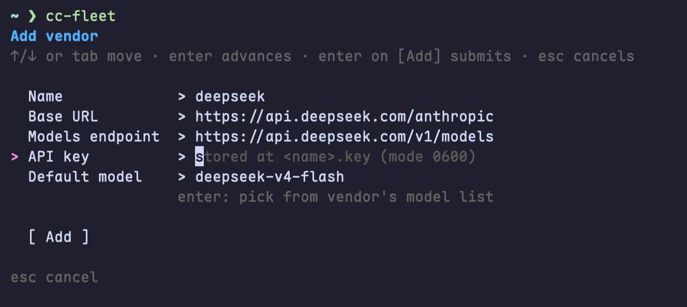

# 🚢 cc-fleet

<p align="center"><strong>🤖 Spawn any vendor LLM — DeepSeek · GLM · Qwen · Kimi · MiniMax … — as real Claude Code teammates or ⚡ one-shot subagents 🚀</strong></p>

<div align="center">

[](https://github.com/ethanhq/cc-fleet/releases)
[](https://www.npmjs.com/package/cc-fleet)
[](https://github.com/ethanhq/cc-fleet/releases)
[](LICENSE)
[](README_zh.md)

</div>

---

<div align="center">


</div>

Vendor workers are **real Claude Code teammates** — driven exactly like native ones — with
the LLM backend swapped to any provider that exposes an Anthropic-compatible API. Your main
session's own auth (OAuth subscription or API key) is untouched; vendor workers bill the
vendor API key via `apiKeyHelper`, and the key never enters env, argv, or shell history.

`cc-fleet` is a small Go CLI plus one Claude Code skill. The CLI manages per-vendor
profiles, dispatches API keys via `apiKeyHelper`, and spawns teammate sessions in tmux
panes. The skill teaches Claude Code *when* to delegate work to those teammates.

## Requirements

- **Claude Code** (the `claude` CLI) on your PATH.
- **tmux** — vendor teammates run in tmux panes.
- **macOS or Linux**, amd64 or arm64 — the tested platforms. Windows can in theory run
  the one-shot **subagent** mode, but it is untested.
- **Teammate** mode needs Claude Code's agent-teams enabled. Turn it on in your global
  `~/.claude/settings.json` and restart Claude Code (cc-fleet also nudges you on first run):
  ```json
  { "env": { "CLAUDE_CODE_EXPERIMENTAL_AGENT_TEAMS": "1" } }
  ```
  The one-shot **subagent** mode works without it.

## Quick Install

**One-line (recommended)**
```bash
curl -fsSL https://raw.githubusercontent.com/ethanhq/cc-fleet/main/install.sh | sh
```
Downloads the prebuilt binary, installs `cc-fleet` + the `ccf` alias, and adds the
skill via the Claude Code plugin. Flags (after `| sh -s --`): `--skill plugin|global|none`,
`--scope user|project|local`, `--prefix DIR`, `--version vX.Y.Z`.

**npm**
```bash
npm install -g cc-fleet      # or run once: npx cc-fleet
```

**go install**
```bash
go install github.com/ethanhq/cc-fleet/cmd/cc-fleet@latest
ln -sf "$(go env GOPATH)/bin/cc-fleet" "$(go env GOPATH)/bin/ccf"   # optional ccf alias
```

**Prebuilt tarball** — download from [Releases](https://github.com/ethanhq/cc-fleet/releases):
```bash
tar -xzf cc-fleet-*.tar.gz && cd cc-fleet-*/ && ./install.sh
```

**From source**
```bash
git clone https://github.com/ethanhq/cc-fleet.git && cd cc-fleet && make install
```

## Getting Started

Run `cc-fleet` (or the `ccf` alias) with no arguments to open the interactive TUI:

```bash
cc-fleet
```

In the TUI you register a vendor — give it a name, its Anthropic-compatible base URL, a
models endpoint, a default model, and paste the API key. The key is written `0600` under
`~/.config/cc-fleet/secrets/` and is **never** passed via argv or shell history.

<p align="center"></p>

The config tree is created automatically on first save, so there is no separate init step.
The TUI also lists your vendors, lets you edit them, and manage multiple keys per vendor.

<p align="center"></p>

Press `tab` to switch to the **Agent status** board — it shows every live teammate grouped by
session → team, with its vendor, model, pane, PID, health, and hidden state, plus a list of
subagent jobs. From here you can hide (`h`) / show (`s`) a teammate pane or refresh (`r`).

<p align="center"></p>

Once at least one vendor is registered, just talk to Claude Code in plain language. The
skill reads your request and picks how to run the work — there are two execution modes.

### Teammate mode — a long-lived vendor worker on your team

> *"Spawn a deepseek teammate to refactor the parser package, then report back."*

Runs the vendor as a **real Claude Code agent-team teammate**:

- Claude calls native `TeamCreate`; cc-fleet launches the vendor's own `claude` process in a tmux pane.
- Claude drives it with native `SendMessage` — you assign tasks, it works and reports back.
- The teammate **stays alive across turns**, so you keep handing it follow-ups. Run several in parallel.
- Your main session keeps its own auth — only the teammate pane bills the vendor key (via `apiKeyHelper`).

> [!NOTE]
> Teammate mode needs Claude Code's agent-teams enabled — see [Requirements](#requirements).

Start inside a tmux session so the teammates split into panes alongside your lead:

```bash
tmux new-session -s cc-fleet
```

<p align="center"></p>

> Lead session on the left; a `deepseek` and a `glm` teammate in their own panes on the right —
> each a real `claude` process, driven by `SendMessage` exactly like a native teammate.

> [!TIP]
> **Not in tmux?** cc-fleet runs the teammate in a detached `cc-fleet-swarm-<team>` server
> instead — same `TeamCreate` / `SendMessage` flow, the pane just isn't on screen. Attach with
> `tmux -L cc-fleet-swarm-<team> attach` to watch it.

### Subagent mode — a one-shot headless call

> *"Use deepseek to summarize this 2,000-line log file."*

`cc-fleet subagent <vendor>` runs the vendor model headless and returns the result
synchronously — **no pane, no team, no agent-teams**. Ideal for one-off analysis and batch
fan-out of independent tasks.

| Flag | Use |
|------|-----|
| `--background` | run detached; poll with `cc-fleet subagent-status` |
| `--resume <id>` | continue a previous subagent (multi-turn) |
| `--max-budget-usd` / `--max-turns` | bound cost and runtime |

> [!NOTE]
> You never pick the mode by hand — Claude decides teammate vs subagent from the request,
> spawns the vendor worker, and coordinates it for you.

### More example prompts

- *"Spawn a glm teammate and a deepseek teammate; have each summarize its model's strengths, then compare the two."*
- *"Use deepseek to review the diff in `internal/spawn` and list any bugs you find."*
- *"Fan out kimi, qwen, and glm subagents over these three files in parallel and collect the results."*
- *"Spin up a deepseek teammate to port the test suite to table-driven form, then report back."*

## CLI & advanced usage

Claude drives the CLI for you, but every command also works by hand — multi-key rotation,
`hide`/`show`, background/resumable subagents, secret backends, teardown order, and more.
See **[CLI reference & advanced usage](docs/cli.md)**, or run `cc-fleet <cmd> --help`.

## The skill

The binary is just the CLI. To teach Claude Code *when* to delegate, install the skill
via the plugin (the one-line installer does this by default):
```bash
claude plugin marketplace add ethanhq/cc-fleet
claude plugin install cc-fleet@ethanhq
```

## Contributing

PRs are very welcome — bug fixes, new vendor recipes, docs, tests, and features. Please read
the **[contribution guide](CONTRIBUTING.md)** first; a few house rules:

- **UI changes and bug fixes need a screenshot or GIF** in the PR.
- **AI-*assisted*** commits credit the tool with a `Co-Authored-By` trailer.
- **Fully AI-*authored*** PRs add an autonomous-PR marker at the bottom of the PR body.

A [PR template](.github/pull_request_template.md) is applied automatically when you open one.

## License

[Apache-2.0](LICENSE).
