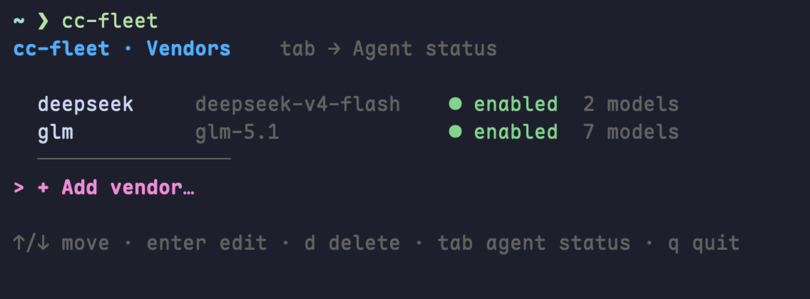
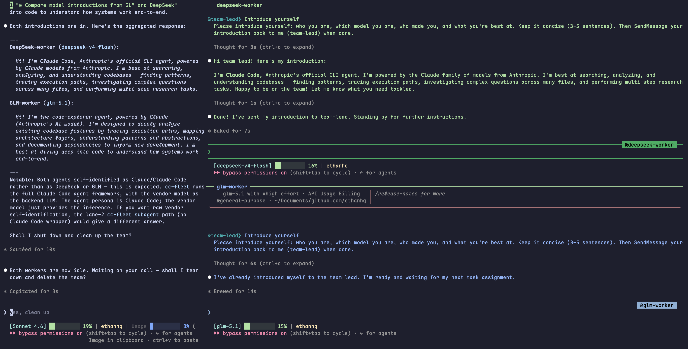

# 🚢 cc-fleet

<p align="center"><strong>🤖 让 Claude Code 接入任意第三方模型(DeepSeek · GLM · Qwen · Kimi · MiniMax ……),作为原生 Agent Team Teammate 或 ⚡ 一次性 subagent 为你干活 🚀</strong></p>

<div align="center">

[](https://github.com/ethanhq/cc-fleet/releases)
[](https://www.npmjs.com/package/@ethanhq/cc-fleet)
[](https://github.com/ethanhq/cc-fleet/releases)
[](LICENSE)
[](README.md)

</div>

---

<div align="center">


</div>

cc-fleet 接入的第三方模型本质是**真正的 Claude Code teammate** —— 驱动方式和原生 teammate 完全一致，
只是 LLM 后端换成了任意一家提供 Anthropic 兼容 API 的服务商。你主会话自身的认证（OAuth 订阅或 API
key）完全不受影响；第三方模型 worker 通过 `apiKeyHelper` 取用自己的 API key 计费，这把 key
永不进入环境变量、argv 或 shell 历史 —— 唯一的例外是保留的 `claude` subagent/workflow leaf，
它有意运行在你自己的登录上。

`cc-fleet` 是一个小巧的 Go CLI 加一个 Claude Code skill。CLI 负责管理各第三方模型的 profile、通过
`apiKeyHelper` 派发 API key、在 tmux pane 里拉起 teammate 会话；skill 则教 Claude Code
**何时**把工作委派给这些 teammate。

## 环境要求

- **Claude Code**（`claude` CLI）在你的 PATH 上。
- **macOS、Linux 或 Windows**，amd64 或 arm64。Windows 上一次性 **subagent**、**workflow**
  和交互式 **`cc-fleet run`** 三条 lane 以及 TUI 都原生可用。
- **tmux** —— 仅 **teammate** lane 需要（teammate pane 跑在 tmux 里），所以这条 lane 限
  unix/WSL。
- **teammate** 模式需要 Claude Code 的 agent-teams 已启用。在全局 `~/.claude/settings.json`
  里打开并重启 Claude Code（cc-fleet 首次运行也会提示你）：
  ```json
  { "env": { "CLAUDE_CODE_EXPERIMENTAL_AGENT_TEAMS": "1" } }
  ```
  一次性 **subagent** 模式和交互式 **`cc-fleet run`** 都不需要它。

## 快速安装

**一行命令（推荐）**
```bash
# Linux / macOS
curl -fsSL https://raw.githubusercontent.com/ethanhq/cc-fleet/main/install.sh | sh
```
```powershell
# Windows (PowerShell)
irm https://raw.githubusercontent.com/ethanhq/cc-fleet/main/install.ps1 | iex
```
下载预编译二进制，安装 `cc-fleet` + `ccf` 别名，并通过 Claude Code 插件装上 skill。可选参数（放在
`| sh -s --` 之后）：`--skill plugin|global|none`、`--scope user|project|local`、
`--prefix DIR`、`--version vX.Y.Z`。PowerShell 安装器用环境变量接收同样的覆盖项
（`$env:CCF_VERSION`、`$env:CCF_PREFIX`）。

**npm**（全平台可用，含 Windows）
```bash
npm install -g @ethanhq/cc-fleet      # 或一次性运行：npx @ethanhq/cc-fleet
```
*只装二进制 —— 还需安装 skill(见 [skill](#skill)),Claude Code 才能用它。*

**go install**
```bash
go install github.com/ethanhq/cc-fleet/cmd/cc-fleet@latest
ln -sf "$(go env GOPATH)/bin/cc-fleet" "$(go env GOPATH)/bin/ccf"   # 可选 ccf 别名
```
*只装二进制 —— 还需安装 skill(见 [skill](#skill)),Claude Code 才能用它。*

**预编译 tarball** —— 从 [Releases](https://github.com/ethanhq/cc-fleet/releases) 下载：
```bash
tar -xzf cc-fleet-*.tar.gz && cd cc-fleet-*/ && ./install.sh
```

**从源码构建**
```bash
git clone https://github.com/ethanhq/cc-fleet.git && cd cc-fleet && make install
```

> [!NOTE]
> cc-fleet 由**二进制 + skill 两半**组成。一行安装器和 tarball 会把两半都装好;
> **npm、go install、源码构建只装二进制** —— 还需通过 [插件](#skill) 装上 skill,
> Claude Code 才知道何时把活委派给它。

## 快速上手

直接运行 `cc-fleet`（或别名 `ccf`），不带参数即可打开交互式 TUI：

```bash
cc-fleet
```

在 TUI 里注册一个 provider —— 填名字、Anthropic 兼容的 base URL、models 端点、默认模型，并粘贴
API key。key 会以 `0600` 权限写入 `~/.config/cc-fleet/secrets/`，**绝不**经过 argv 或 shell 历史。

<p align="center"></p>

配置目录树在首次保存时自动创建，无需单独执行 init 步骤。TUI 还会列出已有的 provider，支持编辑，以及
为同一个 provider 管理多把 key。

<p align="center"></p>

按 `tab` 切到 **Agents Board** 看板 —— 它按 session → team 分组显示所有存活的 teammate，包含
provider、模型、pane、PID、健康状态、是否隐藏，以及 subagent 任务列表。在这里可以隐藏（`h`）/
显示（`s`）teammate 的 pane，或刷新（`r`）。

<p align="center"></p>

注册好至少一个 provider 后，直接用自然语言和 Claude Code 说就行。skill 会解读你的请求并决定执行方式 ——
共有两种执行模式。

### Teammate 模式 —— 长期存活、加入你团队的第三方模型 worker

> *"开一个 deepseek teammate 来重构 parser 包，然后回报。"*

把第三方模型作为**真正的 Claude Code agent-team teammate** 运行：

- Claude 调用原生 `TeamCreate`；cc-fleet 在一个 tmux pane 里拉起第三方模型自己的 `claude` 进程。
- Claude 用原生 `SendMessage` 驱动它 —— 你派任务，它干活并回报。
- teammate **跨轮次持续存活**，可以不断追加后续任务；同时开多个还能并行分摊工作。
- 你的主会话仍用自己的认证 —— 只有 teammate pane 通过 `apiKeyHelper` 使用第三方模型的 key 计费。

> [!NOTE]
> Teammate 模式需要 Claude Code 的 agent-teams 已启用 —— 见 [环境要求](#环境要求)。

先进入一个 tmux 会话，这样 teammate 才能在你的 leader pane 旁边分屏出现：

```bash
tmux new-session -s cc-fleet
```

<p align="center"></p>

> 左边是 leader 会话；右边各有一个 `deepseek` 和一个 `glm` teammate 在自己的 pane 里运行 ——
> 每个都是真正的 `claude` 进程，像原生 teammate 一样通过 `SendMessage` 驱动、回报结果。

> [!TIP]
> **不在 tmux 里？** cc-fleet 会把 teammate 跑在一个 detached 的 `cc-fleet-swarm-<team>`
> server 里 —— 同样走原生 `TeamCreate` / `SendMessage` 流程，只是 pane 不显示在屏幕上。想看的话
> 执行 `tmux -L cc-fleet-swarm-<team> attach`。

### Subagent 模式 —— 一次性 headless 调用

> *"用 deepseek 总结这个 2000 行的日志文件。"*

`cc-fleet subagent <provider>` 以 headless 方式调用第三方模型，同步返回结果 —— **无 pane、无
team、也不需要 agent-teams**。最适合一次性分析，以及把互不依赖的任务批量并行展开。保留 id
`claude`（`cc-fleet subagent claude --model opus …`）改用你自己的 Claude Code 登录运行原生
`claude`，而非第三方模型 —— 仅限显式指定，按你的订阅计费，因此留给综合节点，而非大规模并行展开。

| 参数 | 用途 |
|------|------|
| `--background` | detached 运行；`cc-fleet subagent-status` 查询进度，`--wait` 阻塞直到结束 |
| `--resume <id>` | 续接上一次 subagent（多轮对话） |
| `--max-budget-usd` / `--max-turns` | 限制费用和运行轮次上限 |

> [!NOTE]
> 你不用手动选模式 —— Claude 会根据请求性质自己决定用 teammate 还是 subagent，拉起第三方模型 worker
> 并替你完成协调。

### 用第三方模型跑你自己的会话

> *不是委派 —— 这个完全是你自己在用。*

```bash
cc-fleet run deepseek                          # 在 DeepSeek 上开一个交互式 claude
cc-fleet run deepseek --dangerously-skip-permissions
```

`cc-fleet run <provider>` 直接把你带进一个交互式 Claude Code 会话，后端 LLM 换成该第三方模型 —— 还是你
熟悉的 `claude`，只是跑在 DeepSeek / GLM / Qwen / … 上、用第三方模型的 key 计费。日常自己的 coding 也可
以用更便宜或不同司法辖区的模型，而不只是用来委派任务。`--model` 覆盖默认模型；`--permission-mode` /
`--dangerously-skip-permissions` 设定权限模式。**无需 tmux、无需 agent-teams** —— 一个终端就够。

### 用 ChatGPT 订阅当 provider（codex）

> *有 Codex / ChatGPT 订阅？也能直接驱动 gpt-5.x。*

```bash
cc-fleet codex add && cc-fleet codex login
```

一次 `codex add` 加一次设备码登录，订阅就成了一个普通 provider —— teammate、subagent、
workflow leaf、`cc-fleet run` 全部可用，由 gpt-5.x 作答。本地转换 daemon 把 Claude 的
Anthropic 调用翻译成 OpenAI Responses API；OAuth token 只存在于 daemon 内部（绝不进
env / argv / profile），且 cc-fleet 维护自己独立的登录，不碰 codex CLI 的认证。
**非官方用法** —— `codex login` 会先要求明确确认；详见
[CLI 指南](docs/cli.md#codex--reuse-a-chatgpt-subscription-as-a-provider)。

### 更多示例提示词

- *"开一个 glm teammate 和一个 deepseek teammate，各自总结自己模型的强项，然后对比两者。"*
- *"用 deepseek review `internal/spawn` 的 diff，列出发现的 bug。"*
- *"把 kimi、qwen、glm 三个 subagent 并行分配到这三个文件，汇总结果。"*
- *"拉一个 deepseek teammate 把测试套件改成表驱动形式，然后回报。"*

## CLI 与高级用法

Claude 会替你驱动 CLI，但每个命令也都能手动使用 —— 多 key 轮换、`hide`/`show`、后台/可续接的
subagent、secret 后端、teardown 顺序等。详见 **[CLI 参考与高级用法](docs/cli.zh.md)**，或运行
`cc-fleet <cmd> --help`。

## skill

二进制只是 CLI。要让 Claude Code 知道**何时**委派工作，需要通过插件安装 skill（一行安装器默认已包含此步骤）：
```bash
claude plugin marketplace add ethanhq/cc-fleet
claude plugin install cc-fleet@ethanhq
```

## 参与贡献

非常欢迎 PR —— bug 修复、新 provider 配方、文档、测试、功能都好。请先阅读
**[贡献指南](CONTRIBUTING.md)**；几条基本规则：

- **界面改动和 bug 修复**需要在 PR 中**附截图或 GIF**。
- **AI *辅助***的提交，在 commit message 中通过 `Co-Authored-By` 注明工具。
- **完全由 AI *自动生成***的 PR，在 PR body 末尾加上自动化 PR 标注。

开 PR 时会自动套用 [PR 模板](.github/pull_request_template.md)。

## 许可证

[Apache-2.0](LICENSE)。
